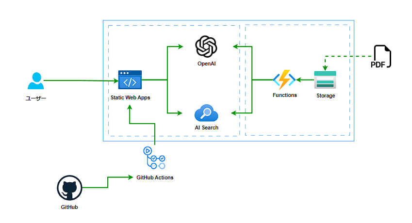

# ReAct アプリケーション

## 全体アーキテクチャ



1. 人からの質問
2. OpenAI へ質問を投げかける。(この時 OpenAI へ送るプロンプトにツールとして AI Search が使えることを含める)
3. OpenAI だけでの解答が難しい場合は、AI Search を使って検索を行い、情報を得る
4. AI Search から得た情報も含めて再度 OpenAI へ情報を送り、回答の要約を作成する
5. 人へ回答を返す

## 検証方法

1. 本 GitHub のリポジトリをご自身の GitHub アカウントに Fork します。
2. 以下のボタンより、Azure へリソースを Deploy します。

<a href="https://portal.azure.com/#create/Microsoft.Template/uri/https%3A%2F%2Fraw.githubusercontent.com%2Fapc-y-satake%2Fpoc-openai-search-webapp%2Fmain%2Farm%2Ftemplate.json" target="_blank">
  
</a>

以下、2 つのリソースが作成されます。

- Azure OpenAI Service
- Azure AI Search

3. Static Web Apps のリソースを作成し、Deploy の設定に先ほどクローンしたリポジトリを設定してください。
4. Static Web Apps の画面左側メニューの構成から追加をクリックして、アプリケーションの設定の箇所に以下の環境変数を設定します。

```
AZURE_OPENAI_API_KEY: Azure OpenAI Service の API キー
AZURE_OPENAI_API_INSTANCE_NAME: Azure OpenAI Service の リソース名
AZURE_OPENAI_API_DEPLOYMENT_NAME: Azure OpenAI Studio の デプロイメント名
AZURE_OPENAI_API_VERSION: 2023-08-01-preview で ok
AZURE_OPENAI_API_ENDPOINT: Azure OpenAI Service の エンドポイント
AZURE_COGSRCH_SERVICE_NAME: Azure AI Search の リソース名
AZURE_COGSRCH_ADMIN_KEY: Azure AI Search の 管理キー
AZURE_COGSRCH_API_VERSION: 2021-04-01 で ok
AZURE_COGSRCH_INDEX_NAME: Azure AI Search の インデックス名
```

5. 動作確認
   自動デプロイが完了した後、Azure Static Web Apps の URL へアクセスします。
